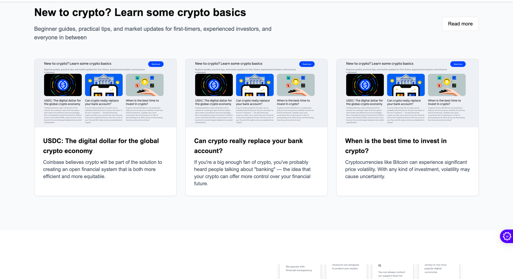

# Crypto Platform

A modern, feature-rich cryptocurrency trading and educational platform built with Next.js 14, TypeScript, and Tailwind CSS.

## Features

- 🔐 User Authentication (Sign In/Sign Up)
- 📊 Real-time Cryptocurrency Statistics
- 💰 Portfolio Management
- 📱 Responsive Design
- 🎓 Educational Resources
- 💸 USDC Staking with 4.5% APY
- 🎨 Modern UI with Radix UI Components

## Screenshots

### Add your application screenshots here

1. Homepage


1. Portfolio Dashboard


1. Trading Interface


> **Adding Screenshots:**
> 1. Navigate to `/public/screenshots` directory (already created)
> 2. Take high-quality screenshots of your application's key features:
>    - Homepage and landing page
>    - Dashboard interface
>    - Trading view
>    - Portfolio management
>    - Educational sections
> 3. Save screenshots with descriptive names (e.g., `public/Screenshot 2025-01-21 at 12.56.30.png, `[trading-view.png](https://github.com/TabbyMichael/Crypto/blob/main/public/Screenshot%202025-01-21%20at%2012.57.04.png)`)
> 4. Update the image paths in this README accordingly
> 5. Recommended specifications:
>    - Resolution: 1920x1080 (minimum)
>    - Format: PNG or JPG
>    - Aspect ratio: 16:9
>    - Max file size: 2MB per image

## Tech Stack

- **Framework:** Next.js 14
- **Language:** TypeScript
- **Styling:** Tailwind CSS
- **UI Components:** 
	- Radix UI
	- Shadcn UI Components
- **Form Handling:** React Hook Form
- **Validation:** Zod
- **Charts:** Recharts
- **Date Handling:** date-fns
- **Carousel:** Embla Carousel

## Getting Started

1. Clone the repository:
```bash
git clone [repository-url]
```

2. Install dependencies:
```bash
pnpm install
npm install
```

3. Run the development server:
```bash
pnpm run dev 
npm run dev
```

4. Open [http://localhost:3000](http://localhost:3000) in your browser.

## Project Structure

- `/app` - Next.js app router files
- `/components` - Reusable UI components
- `/components/ui` - Base UI components
- `/hooks` - Custom React hooks
- `/lib` - Utility functions
- `/public` - Static assets
- `/styles` - Global styles

## Key Components

- `StatsSection` - Displays cryptocurrency statistics
- `FeaturesSection` - Showcases platform features
- `LearnSection` - Educational content section
- `PortfolioCTA` - Portfolio call-to-action section
- `SignInForm/SignUpForm` - Authentication forms

## Development

```bash
# Run development server
pnpm dev

# Build for production
pnpm build

# Start production server
pnpm start

# Run linting
pnpm lint
```

## License

[License Type] - See LICENSE file for details